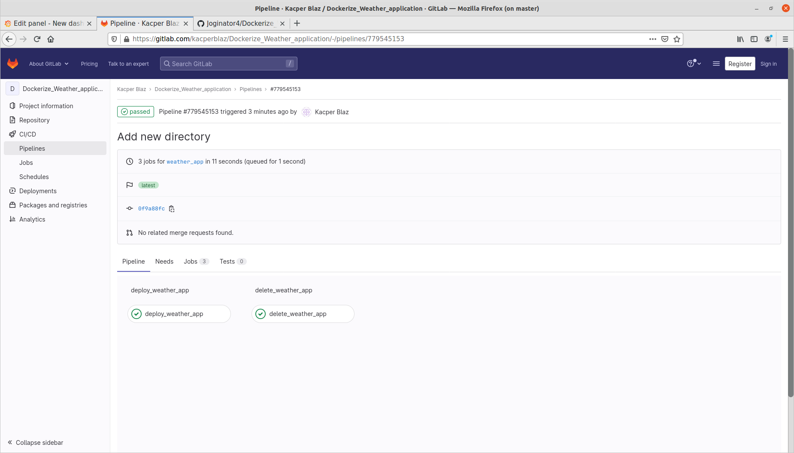
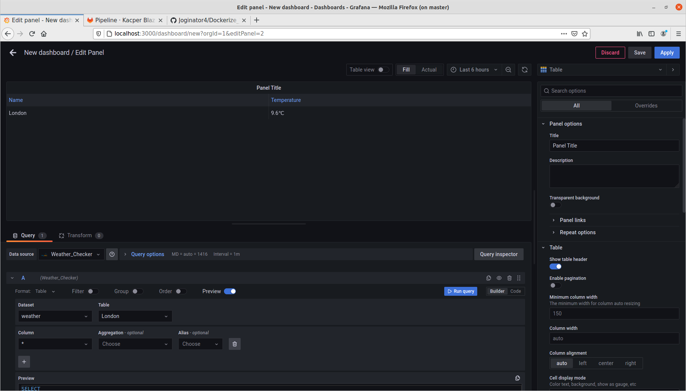

This project is containarized weather application . We are creating stack of containers Python,MySQL and Grafana. Prometheus node-exporter and cadvisor are added here in addition. Python container is taking name and temperature of selected city from API and sending it by csv file format to MYSQL database creating a table with selected name. MYSQL is integrated with grafana , so we can visualize our created table in grafana.

